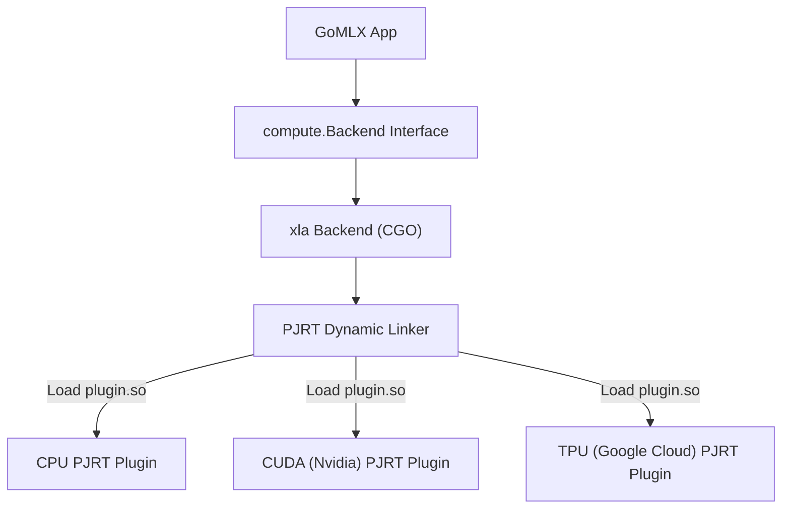

## Overview

GoMLX is a Machine Learning focused API, that "lowers" computations into a standard portable internal GO API defined in `compute.Backend`.

If you are simply using GoMLX, you don't really need to worry about the backend API, you just need to know that you can select, based
on where you want to execute your models (CUDA, CPU, using pure Go). Simply create a backend at program startup with `compute.New()` and
reuse it throughout the application lifetime.

---
## Configuring the Execution Environment

Most programs will simply use `compute.New()` to create a backend in a program, or `testutil.BuildTestBackend()` for tests.
Both default to the "best" backend available (out of the linked in backends).

You can configure which backend to use and specify options in two ways: programmatically using the
`compute.NewWithConfig(config)` function or setting the environment variable 
**`GOMLX_BACKEND`**, which will be used by `compute.New()`.

Example `config` (or `GOMLX_BACKEND`) values:

  * `go`: Forces the pure Go backend.
  * `xla`: Uses the XLA backend. It will attempt to use one of TPU, CUDA (Nvidia GPU), or CPU in that order.
    You can also specify which XLA plugin to use explicitly: E.g.: `xla:cpu`, `xla:cuda`.

See below for specific backend configurations.


## Supported Backends

---

### 1. The XLA Backend (`"xla"`)
This is the default and highest-performance backend. It calls XLA (the compiler powering JAX, TensorFlow, and PyTorch/XLA) to compile graphs to optimized machine code.

* **Pros**: Incredibly fast, supports GPU (CUDA) and TPU execution, performs operator fusion and memory optimizations automatically.
* **Cons**: Relies on CGO (which requires C/C++ dependencies) and currently only supports static shapes (compilation is tied to fixed input dimensions).

The `xla` plugin expects a config string in the format `xla:<plugin>[,<option>=<value>]...`. Where `<plugin>` can be set to "cpu", "cuda" or "tpu" or 
the path for the PJRT plugin (see below) to use. The following options are supported:


Configuration options:

- **`tf32`** (boolean, default=true): controls whether to use TF32 for DotGeneral operations that are using float32
  (it can be faster in modern GPUs). It's enabled by default.
- **`shared_buffer`** (boolean, default=true): controls whether to use shared buffers for the device buffer
  (where device=CPU). It's enabled by default if the plugin is called "cpu".
- **`preallocate`** (boolean, default=false): whether the CUDA PJRT preallocates a large portion of the memory.
- **`memory_fraction`** (float, default=0.75): how much memory to preallocate, if preallocate=true. CUDA only.
- **`allocator`** (string, default="default"): which allocator to use. For CUDA the available ones are "default"
  (== "bfc"), "bfc" ("best-fit for coalescing", avoids framementation), "cuda_async" (dynamic, no preallocation),
  "platform" (slow, good for debugging), "vmm". CUDA only.
- **`visible_devices`** (list of integers, e.g., "0;1;2"): list IDs of the devices made visible to the backend.
- **`use_tfrt_gpu_client`** (boolean, default=false): uses the "TFRT" dispatcher for GPU.

Example:

* **`GOMLX_BACKEND=xla:cuda,preallocate=true`**: Use XLA CUDA, and preallocate 75% (the default) for faster memory management for this session.

The PJRT plugins also read the `XLA_FLAGS` environment variable for additional lower-level configurations. Set `XLA_FLAGS=--help` and 
it will return an error with the messages.

#### XLA's Pluggable PJRT Plugin Architecture

XLA uses a "plugin" model, where it defines a standard C API called **PJRT** ("Pretty much Just another RunTime") 
and a language (_StableHLO_) to express the computation and there are plugins (sometimes closed source) that implement
them.  

If you are only using GoMLX, you don't need to know this, but if you are curious, this is how it looks:



PJRT plugins are dynamically loaded libraries (`.so` on Linux, `.dylib` on macOS, `.dll` on Windows). There is typically one plugin per target hardware accelerator.

#### PJRT Auto-Installation
To simplify the developer experience, GoMLX includes an auto-installer. At startup, the `xla` package checks if a compatible PJRT plugin is installed. If not, it downloads and caches the required binaries locally in:
* **Linux**: `~/.local/lib/go-xla/`
* **macOS**: `~/Library/Application Support/go-xla/`
* **Windows**: `~\AppData\Local\go-xla\`

#### Disabling Auto-Installation
For offline deployment or custom production builds (like Docker images), auto-installation can be disabled:
* **Via Environment Variable**: Set `GOMLX_NO_AUTO_INSTALL=1`.
* **Programmatically**: Call `xla.EnableAutoInstall(false)` before initializing the backend.

---

### 2. The Go Backend (`"go"`)
A pure Go implementation of the compute API. It does not use CGO or C++ libraries.

* **Pros**: 100% portable. It compiles easily to WebAssembly (WASM) and runs in the browser, making it possible to deploy models on client-side web apps.
* **Cons**: Slower than XLA for heavy model training.
* **Performance Enhancements**:
  * **SIMD support**: Utilizes Go 1.26's experimental `simd/archsimd` package (AVX2/AVX512) for high-performance matrix multiplications (matmul).
  * **Fused Operations**: Implements fused activation and layer operations to minimize memory allocation.
  * **Quantization**: Supports quantized operations for faster inference on smaller memory footprints.

It accepts the following special environment variables for tuning:

* **`GOMLX_SIMD_AVX512`**: Set to `0` or `false` to disable AVX512 SIMD vectorization.
* **`GOMLX_SIMD_AVX2`**: Set to `0` or `false` to disable AVX2 SIMD vectorization.
* **`GOMLX_FUSION`**: Set to `0` or `false` to disable fused operations.

It's relatively easy to add specialized fused operations, or SIMD versions for specific CPUs. Open an issue in the GoMLX repo, or reach use out in
our slack channel for questions.

---

### 3. The Darwin ML Backend (`"go-darwinml"`)
*(Experimental)* Implements bindings to Apple’s native CoreML and Metal Performance Shaders (MPSGraph) runtimes.

* **Pros**: Leverages Apple Silicon's Apple Neural Engine (ANE) and unified memory GPU (Metal) on Macs.

---

## Backend Compliance Testing

**For anyone wanting to develop a new backend.**

To ensure different backend engines behave identically and yield mathematically correct results, GoMLX includes a compliance test suite in `support/backendtest`.

If you write a custom backend, you can run all compliance checks by referencing this package in your test file:

```go
package mybackend_test

import (
    "testing"
    "github.com/gomlx/compute/support/backendtest"
)

func TestCompliance(t *testing.T) {
    // Run all official compliance tests against your backend
    backendtest.RunAll(t, myBackend)
}
```
Compliance tests automatically check backend capabilities. Any tests that require operations your backend does not yet implement are gracefully skipped.
