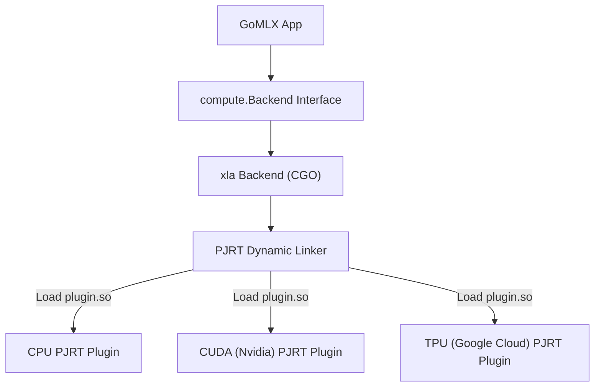

## Overview

GoMLX is a Machine Learning focused API, that "lowers" computations into a standard portable internal GO API defined in `compute.Backend`.

If you are simply using GoMLX, you don't really need to worry about the backend API, you just need to know that you can select, based
on where you want to execute your models (CUDA, CPU, using pure Go). Simply create a backend at program startup with `compute.New()` and
reuse it throughout the application lifetime.

---
## Configuring the Execution Environment

Most programs will simply use `compute.New()` to create a backend in a program, or `testutil.BuildTestBackend()` for tests.
Both default to the "best" backend available (out of the linked in backends).

You can configure which backend to use and specify options in two ways: programmatically using the
`compute.NewWithConfig(config)` function or setting the environment variable 
**`GOMLX_BACKEND`**, which will be used by `compute.New()`.

Example `config` (or `GOMLX_BACKEND`) values:

  * `go`: Forces the pure Go backend.
  * `xla`: Uses the XLA backend. It will attempt to use one of TPU, CUDA (Nvidia GPU), or CPU in that order.
    You can also specify which XLA plugin to use explicitly: E.g.: `xla:cpu`, `xla:cuda`.
  * `onnx`: Uses the ONNX Runtime backend (included by `backends/default` when built with `-tags=onnx`, or by importing `github.com/gomlx/compute-onnx`).
    You can also specify which accelerator to use explicitly: E.g.: `onnx:cpu`, `onnx:cuda`, `onnx:migraphx`.

See below for specific backend configurations.


## Supported Backends

---

### 1. The XLA Backend (`"xla"`)
This is the default and highest-performance backend. It calls XLA (the compiler powering JAX, TensorFlow, and PyTorch/XLA) to compile graphs to optimized machine code.

* **Pros**: Incredibly fast, supports GPU (CUDA) and TPU execution, performs operator fusion and memory optimizations automatically.
* **Cons**: Relies on CGO (which requires C/C++ dependencies) and currently only supports static shapes (compilation is tied to fixed input dimensions).

The `xla` plugin expects a config string in the format `xla:<plugin>[,<option>=<value>]...`. Where `<plugin>` can be set to "cpu", "cuda" or "tpu" or 
the path for the PJRT plugin (see below) to use. The following options are supported:


Configuration options:

- **`tf32`** (boolean, default=true): controls whether to use TF32 for DotGeneral operations that are using float32
  (it can be faster in modern GPUs). It's enabled by default.
- **`shared_buffer`** (boolean, default=true): controls whether to use shared buffers for the device buffer
  (where device=CPU). It's enabled by default if the plugin is called "cpu".
- **`preallocate`** (boolean, default=false): whether the CUDA PJRT preallocates a large portion of the memory.
- **`memory_fraction`** (float, default=0.75): how much memory to preallocate, if preallocate=true. CUDA only.
- **`allocator`** (string, default="default"): which allocator to use. For CUDA the available ones are "default"
  (== "bfc"), "bfc" ("best-fit for coalescing", avoids framementation), "cuda_async" (dynamic, no preallocation),
  "platform" (slow, good for debugging), "vmm". CUDA only.
- **`visible_devices`** (list of integers, e.g., "0;1;2"): list IDs of the devices made visible to the backend.
- **`use_tfrt_gpu_client`** (boolean, default=false): uses the "TFRT" dispatcher for GPU.

Example:

* **`GOMLX_BACKEND=xla:cuda,preallocate=true`**: Use XLA CUDA, and preallocate 75% (the default) for faster memory management for this session.

The PJRT plugins also read the `XLA_FLAGS` environment variable for additional lower-level configurations. Set `XLA_FLAGS=--help` and 
it will return an error with the messages.

#### XLA's Pluggable PJRT Plugin Architecture

XLA uses a "plugin" model, where it defines a standard C API called **PJRT** ("Pretty much Just another RunTime") 
and a language (_StableHLO_) to express the computation and there are plugins (sometimes closed source) that implement
them.  

If you are only using GoMLX, you don't need to know this, but if you are curious, this is how it looks:



PJRT plugins are dynamically loaded libraries (`.so` on Linux, `.dylib` on macOS, `.dll` on Windows). There is typically one plugin per target hardware accelerator.

#### PJRT Auto-Installation
To simplify the developer experience, GoMLX includes an auto-installer. At startup, the `xla` package checks if a compatible PJRT plugin is installed. If not, it downloads and caches the required binaries locally in:
* **Linux**: `~/.local/lib/go-xla/`
* **macOS**: `~/Library/Application Support/go-xla/`
* **Windows**: `~\AppData\Local\go-xla\`

#### Disabling Auto-Installation
For offline deployment or custom production builds (like Docker images), auto-installation can be disabled:
* **Via Environment Variable**: Set `GOMLX_NO_AUTO_INSTALL=1`.
* **Programmatically**: Call `xla.EnableAutoInstall(false)` before initializing the backend.

---

### 2. The Go Backend (`"go"`)
A pure Go implementation of the compute API. It does not use CGO or C++ libraries.

* **Pros**: 100% portable. It compiles easily to WebAssembly (WASM) and runs in the browser, making it possible to deploy models on client-side web apps.
* **Cons**: Slower than XLA for heavy model training.
* **Performance Enhancements**:
  * **SIMD support**: Utilizes Go 1.26's experimental `simd/archsimd` package (AVX2/AVX512) for high-performance matrix multiplications (matmul).
  * **Fused Operations**: Implements fused activation and layer operations to minimize memory allocation.
  * **Quantization**: Supports quantized operations for faster inference on smaller memory footprints.

It accepts the following special environment variables for tuning:

* **`GOMLX_SIMD_AVX512`**: Set to `0` or `false` to disable AVX512 SIMD vectorization.
* **`GOMLX_SIMD_AVX2`**: Set to `0` or `false` to disable AVX2 SIMD vectorization.
* **`GOMLX_FUSION`**: Set to `0` or `false` to disable fused operations.

It's relatively easy to add specialized fused operations, or SIMD versions for specific CPUs. Open an issue in the GoMLX repo, or reach use out in
our slack channel for questions.

---

### 3. The Darwin ML Backend (`"go-darwinml"`)
*(Experimental)* Implements bindings to Apple’s native CoreML and Metal Performance Shaders (MPSGraph) runtimes.

* **Pros**: Leverages Apple Silicon's Apple Neural Engine (ANE) and unified memory GPU (Metal) on Macs.


---

### 4. The ONNX Runtime Backend (`"onnx"`)
Uses [ONNX Runtime](https://onnxruntime.ai/) (ORT) to execute GoMLX computation graphs on Linux and Windows (amd64). Implemented in package [`github.com/gomlx/compute-onnx`](https://github.com/gomlx/compute-onnx).

* **Pros**: Interoperability with the ONNX ecosystem, ability to execute ONNX models, and support for exporting trained GoMLX models to the standard `.onnx` file format.
* **Cons**: Requires CGO/C++ dependencies for ONNX Runtime. Currently supports Linux/amd64 and Windows/amd64.
* **Importing**: Included in `github.com/gomlx/gomlx/backends/default` when building with `-tags=onnx`. Alternatively, import `github.com/gomlx/compute-onnx` directly.

Configuration options (via `GOMLX_BACKEND=onnx:<options>`):

- **`cpu`**: Forces CPU execution.
- **`cuda`** (or **`gpu`**): Forces CUDA GPU execution via the ONNX Runtime CUDA Execution Provider.
- **`migraphx`** (or **`rocm`**, **`amd`**) *(Experimental)*: Forces AMD GPU execution via the ONNX Runtime MIGraphX Execution Provider.
  Requires ROCm and MIGraphX to be installed (`sudo apt install migraphx migraphx-dev half`). If no ORT library with the
  MIGraphX provider is found, one is automatically installed from [AMD's manylinux wheels](https://repo.radeon.com/rocm/manylinux/)
  matching the local ROCm version — it can also be installed manually with
  `go run github.com/gomlx/compute-onnx/cmd/onnxruntime_installer -migraphx`.
  *Notes / Limitations*:
  - Only `float32`, `int32`, and `int64` graphs are supported.
  - Models with scalar (0-dimensional) inputs fail (upstream issue).
  - Buffers are currently transferred back to CPU (host), which makes training slower.
- **`migraphx_cache_dir=<path>`**: Directory where the MIGraphX compiled-program (`.mxr`) for each model is cached, skipping expensive graph compilation on subsequent runs. Can also be set via `GOMLX_MIGRAPHX_CACHE_DIR`.
- **`<path/to/libonnxruntime.so>`**: Explicit path to the ONNX Runtime shared library binary (`.so`, `.dylib`, or `.dll`), bypassing `ONNXRUNTIME_SHARED_LIBRARY_PATH`.
- **`log=<level>`**: Sets internal logging severity level (0=Error, 1=Warning, 2=Info, 3=Verbose).
- **Default (empty)**: Auto-detects if an NVIDIA GPU is available and defaults to CUDA if present, then checks for a discrete AMD GPU (ROCm/MIGraphX), otherwise falling back to CPU.

Example: `GOMLX_BACKEND="onnx:cuda,log=2"`, `GOMLX_BACKEND=onnx:migraphx`, or `GOMLX_BACKEND="onnx:/path/to/libonnxruntime.so"`

#### ONNX Runtime Auto-Installation
The ONNX Runtime backend includes an auto-installer. At startup, if the ONNX Runtime shared library (`libonnxruntime.so` on Linux, `libonnxruntime.dylib` on macOS, `onnxruntime.dll` on Windows) is not found, it automatically downloads and extracts the official ONNX Runtime binaries locally into:
* **Linux**: `~/.local/lib/onnxruntime/` (or `~/.local/lib/onnxruntime-migraphx/` for MIGraphX)
* **macOS**: `~/Library/Application Support/onnxruntime/`
* **Windows**: `~\AppData\Local\onnxruntime\`

#### Custom Library Path & Disabling Auto-Installation
* **Custom Library Path**: Specify an explicit shared library location by passing a path in the configuration string (e.g. `GOMLX_BACKEND=onnx:/path/to/libonnxruntime.so`, which bypasses `ONNXRUNTIME_SHARED_LIBRARY_PATH`), or by setting the `ONNXRUNTIME_SHARED_LIBRARY_PATH` environment variable.
* **Disabling Auto-Installation**: Set environment variable `GOMLX_NO_AUTO_INSTALL=1` or call `onnxbackend.EnableAutoInstall(false)` programmatically before initializing the backend to prevent automatic downloads (ideal for offline environments or production Docker builds).
* **Standalone Installer Utility**: You can pre-install libraries using the CLI tool in `github.com/gomlx/compute-onnx/cmd/onnxruntime_installer` (pass `-migraphx` to install the ROCm/MIGraphX build).

#### AMD ROCm / MIGraphX Environment Variables *(Experimental)*
The MIGraphX execution provider relies on a local ROCm installation:
* **`ROCM_PATH`**: Directory where ROCm is installed (defaults to `/opt/rocm`). Used to locate `rocminfo` and HIP/MIGraphX libraries when auto-detecting AMD GPUs and ROCm versions.
* **`GOMLX_MIGRAPHX_CACHE_DIR`**: Directory where MIGraphX compiled programs (`.mxr`) are cached, skipping expensive graph compilation on subsequent runs. Equivalent to the `migraphx_cache_dir` configuration key (e.g. `GOMLX_BACKEND=onnx:migraphx,migraphx_cache_dir=/tmp/mxr`); an empty value disables caching.

#### Debugging & Saving Models on Compilation Failure
* **Save Model on Failure**: If graph compilation or session creation fails, set environment variable `GOMLX_ONNX_SAVE_ON_FAILURE=/path/to/failed_model.onnx`. When set, the backend will write the serialized ONNX model protobuf to that file path for inspection and print a `klog` notification.

#### Exporting / Saving Models to `.onnx` Format

With the `onnx` backend enabled, you can save trained GoMLX models to standard `.onnx` files. These files can then be loaded and executed with ONNX Runtime in GoMLX or deployed in other languages and inference engines.

* **Package**: [`github.com/gomlx/gomlx/ml/model/onnx`](https://pkg.go.dev/github.com/gomlx/gomlx/ml/model/onnx) (protected by build tag `//go:build onnx`).
* **Key Functions**:
  * `onnx.SaveToFile(backend, exec, filePath, inputShapes, inputNames, outputNames)`: Exports the computation graph and model parameters to an `.onnx` file.
  * `onnx.Save(backend, exec, writer, inputShapes, inputNames, outputNames)`: Exports the ONNX model to an `io.Writer`.
  * `onnx.LoadFromFile(backend, filePath)` / `onnx.Load(backend, reader)`: Loads an `.onnx` model into an executable for inference within GoMLX.
  * `onnx.IsONNX(backend)`: Returns `true` if the provided `compute.Backend` is an ONNX backend instance (`*onnxbackend.Backend`).
* **Dynamic Axes**: Supports dynamic input dimensions (such as variable batch sizes) using `exec.WithDynamicAxes(...)` and `shapes.MakeDynamic(...)`.
* **Example**: See the [`save_onnx.go`](https://github.com/gomlx/gomlx/blob/main/examples/adult/demo/save_onnx.go) demo in the UCI-Adult example (build with `-tags=onnx`).

#### WebAssembly / Browser Execution (ONNX Runtime Web)

The `onnx` backend also supports compiling to WebAssembly (`GOOS=js GOARCH=wasm`) and executing inside web browsers via [ONNX Runtime Web](https://github.com/gomlx/compute-onnx/blob/main/docs/ort-web.md).

* **Supported Execution Providers**:
  * **`webgpu`** (or `gpu`): Hardware-accelerated GPU shader execution via WebGPU (best for large vision/transformer models and parallel batches).
  * **`wasm`** (or `cpu`): High-speed CPU WebAssembly execution using SIMD instructions (best latency for small models and single-sample loops).
  * **`webnn`**: Hardware NPU/GPU acceleration via the experimental Web Neural Network API in Chromium.
* **Auto-Detection**: Automatically detects WebGPU hardware availability at startup and defaults to `webgpu` if present, otherwise falling back to `wasm` CPU.
* **Zero-Config Script Loading**: If `ort.min.js` is not embedded in the page, the backend automatically injects it from the official CDN at runtime.

#### Inspecting & Visualizing `.onnx` Files

* **CLI Printer (`onnx_printer`)**: To inspect the contents, shapes, initializers, and operations of a `.onnx` model file directly in the terminal, use the `onnx_printer` utility in `github.com/gomlx/compute-onnx/cmd/onnx_printer`:
  ```bash
  go run github.com/gomlx/compute-onnx/cmd/onnx_printer path/to/model.onnx
  ```
  It formats tensor shapes using GoMLX `shapes.Shape` (including dynamic dimension names), prints operations on a single line per op, and truncates large constant tensors (use `-max_items` or `-n` to control element limit).
* **Graphical Visualization**: For interactive graphical diagram visualization of ONNX computation graphs, open your `.onnx` model file using [Netron](https://netron.app/).


---

## Devices and `DeviceNum`

A backend can be connected to multiple accelerator devices (for instance, a machine with multiple GPUs or a TPU pod). To address specific devices within a backend, GoMLX uses the `compute.DeviceNum` type (which is an integer wrapper).

* **Single-Device Default**: If you are not using multiple accelerators, you can always simply default this device number to `0`.
* **Addressing Devices**: For multi-device setups, device numbers range from `0` to `backend.NumDevices() - 1`. You specify this number when allocating buffers on specific devices (e.g., in `tensors.FromShapeForBackend`), performing distributed computations, or pinning executions.

There is support for distributed execution, including distributed datasets and distributed training, see packages `compute/distributed`, `gomlx/core/tensors/dtensor` along with the standard packages to train models.

---

## Backend Compliance Testing

**For anyone wanting to develop a new backend.**

To ensure different backend engines behave identically and yield mathematically correct results, GoMLX includes a compliance test suite in `support/backendtest`.

If you write a custom backend, you can run all compliance checks by referencing this package in your test file:

```go
package mybackend_test

import (
    "testing"
    "github.com/gomlx/compute/support/backendtest"
)

func TestCompliance(t *testing.T) {
    // Run all official compliance tests against your backend
    backendtest.RunAll(t, myBackend)
}
```
Compliance tests automatically check backend capabilities. Any tests that require operations your backend does not yet implement are gracefully skipped.
