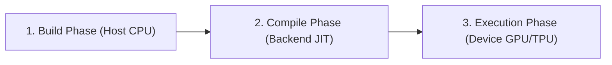

## Overview

Unlike standard eager Go code, GoMLX uses **symbolic computation**. You define your computations as Go functions that build a **computation graph** composed of node operations. This graph is then compiled and optimized as a whole, then executed on the selected backend (CPU, GPU, or TPU).

---

## The JIT Compilation Model

Working with GoMLX graphs involves three distinct phases:



1. **Build Phase (Host CPU)**: Your Go code executes sequentially. Instead of processing numbers, it registers operations (like `Add`, `Mul`, `Dot`) in a `*graph.Graph` object. The outputs are symbolic `*graph.Node` pointers representing "future values" with specific shapes and data types.
2. **Compile Phase (Backend JIT)**: When the executor is called for the first time with a new input shape, the backend (e.g., XLA) takes the symbolic graph, optimizes it (e.g., fusing consecutive operations, choosing layouts), and compiles it into a hardware-specific executable binary.
3. **Execution Phase (Device)**: The compiled binary executes on the accelerator device. Tensors are fed as inputs, and the device performs highly parallel execution, returning the outputs as new tensors. It's still your
Go program that calls the execution (and feeds inputs and consume outputs), but the execution itself happens on device. The backends support **parallel graph executions**, but you may want to limit it due to constrains
on memory.

---

## Node Abstraction (`*graph.Node`)

Inside a graph function, a `*graph.Node` is a reference to the output of an operation. 

* **No direct inspection**: You cannot read or print the numeric contents of a `*graph.Node` during the building phase—it doesn't have a value yet.
* **Shape and DType check**: The node does know its **shape** and data type (`dtypes.DType`). GoMLX uses this information to validate operations at graph building time, catching rank or type mismatches (e.g., adding a `Float32` to an `Int64`) before compiling.
* **Graph Reference**: Every node holds a reference to its parent graph, which can be retrieved with `node.Graph()`.

Example:

<!-- sync_code: file=computation-graph/main.go tag=distance_fn -->
```go
// EuclideanDistance between two values.
func EuclideanDistance(a, b *Node) *Node {
	return Sqrt(ReduceAllSum(Square(Sub(a, b))))
}
```
<div align="right"><small><a href="https://github.com/gomlx/gomlx/blob/main/examples/gomlx.github.io/computation-graph/main.go#L14">(See source)</a></small></div>

---

## Graph Functionality

GoMLX provides a rich set of node operations in the [graph](https://pkg.go.dev/github.com/gomlx/gomlx/core/graph) package. Common categories of functionality include:

### 1. Mathematical & Element-wise Operators
Standard arithmetic and unary operations applied element-by-element across tensors:
* **Arithmetic**: `Add`, `Sub`, `Mul`, `Div`
* **Powers & Logarithms**: `Square`, `Sqrt`, `Exp`, `Log`, `Abs`
* **Trigonometric**: `Sin`, `Cos`, `Tanh`, `Sigmoid`
* **Convenience Scalar Ops**: `AddScalar`, `MulScalar`, `DivScalar` (e.g., `AddScalar(x, 1.0)`)

### 2. Reductions
Reduce dimensions along specified axes:
* **Common Reductions**: `ReduceSum`, `ReduceMax`, `ReduceMin`, `ReduceProduct`
* **Logical Reductions**: `ReduceAnd`, `ReduceOr`
* **Convenience Utilities**: `ReduceAllSum`, `ReduceAllMax` (collapses the entire tensor to a 1D scalar)
* **Dimension Preservation**: Use `ReduceAndKeep` to keep the reduced dimensions as size-1 axes.

### 3. Shape & Dimension Manipulation
Reorganize axes, pad data, or extract slices:
* **Reshaping**: `Reshape` changes the dimensions without altering data layout.
* **Transposition**: `Transpose` permutes axes.
* **Concatenation**: `Concatenate` joins multiple nodes along a shared axis.
* **Slicing & Padding**: `Slice`, `Pad`, `Gather`, `Scatter`.

### 4. Linear Algebra
High-performance matrix operations:
* **Matrix Multiplication**: `Dot` (generic dot product contraction), `DotProduct`.
* **Einstein Summation**: `Einsum` allows writing complex contractions (like batch matrix multiply, outer products) using Einstein notation.

### 5. Control Flow & Conditionals
Go conditional statements (`if`) run during graph building, not execution. To perform element-wise execution-time conditionals, use:
* **Logical Ops**: `LogicalAnd`, `LogicalOr`, `LogicalNot`, `IsZero`
* **Comparison Ops**: `Equal`, `Less`, `Greater`, `LessOrEqual`, `GreaterOrEqual`
* **Selection**: `Where(condition, trueNode, falseNode)` acts like a ternary selector.

### 6. Random Number Generation (RNG)
GoMLX implements **stateless functional random number generation** (similar to JAX):
* **State Propagation**: RNG operations require passing and returning an `RNGState` node. This guarantees that model initialization and dropout are fully reproducible.
* **Distributions**: `RandomNormal`, `RandomUniform`, `RandomBinomial`.

---

## Graph Execution (Stateless)

To execute a computation graph, you wrap your graph-building function in a `graph.Exec` object. The executor compiles the graph when called for the first time and manages its execution.

Standard executors are created using `graph.NewExec(backend, graphFn)` (returns an error) or `graph.MustNewExec(backend, graphFn)` (panics on error).

It accepts various signatures for graph building function (using generics), and some aliases for fixed number of outputs, to improve ergonomics.

### Executing the Graph
You call the executor by passing either concrete `*tensors.Tensor` objects or standard Go values (like scalars or slices, which are automatically converted to tensors and uploaded to the device).

<!-- sync_code: file=computation-graph/main.go tag=main_exec -->
```go
import (
	"fmt"

	"github.com/gomlx/compute"
	_ "github.com/gomlx/gomlx/backends/default"
	. "github.com/gomlx/gomlx/core/graph"
)

// EuclideanDistance between two values.
func EuclideanDistance(a, b *Node) *Node {
	return Sqrt(ReduceAllSum(Square(Sub(a, b))))
}

// 1. Create the executor (that expects 1 output)
exec, err := NewExec1(backend, EuclideanDistance)
if err != nil {
	panic(err)
}

// 2. Call the executor with inputs (automatically JIT-compiled for Float64[] slices)
resultTensor, err := exec.Call([]float64{1.0, 2.0}, []float64{4.0, 6.0})
if err != nil {
	panic(err)
}

// 3. Print the result: float64(5)
fmt.Printf("Distance: %s\n", resultTensor)
```
<div align="right"><small><a href="https://github.com/gomlx/gomlx/blob/main/examples/gomlx.github.io/computation-graph/main.go#L14">(See source)</a></small></div>

Output:

<!-- sync_code: file=computation-graph/main.go output_tag=main_exec -->
```
Distance: float64(5)
```

A `graph.Exec` is completely **stateless**. Every execution computes the output strictly from the arguments passed to `.Call()`. The graph does not store weights or persist mutable variables between calls.


**Executing Stateful Models**: If you need execution state (such as neural network weights that persist and are updated across training iterations), use `model.Exec` instead. It wraps the core `graph.Exec` and automatically passes variables from a `model.Store` as side-inputs and side-outputs. See [Model Store and Scope](/docs/model-store/) to learn more.


---

## Automatic Differentiation (Gradients)

To train machine learning models, GoMLX computes gradients symbolically at graph building time using back-propagation.

```go
// Gradient calculates symbolic gradients of the scalar loss w.r.t the target nodes.
grads := Gradient(scalarLoss, weightNode, biasNode)
gradWeight, gradBias := grads[0], grads[1]
```

* **Scalar Loss Requirement**: The first argument to `Gradient` must evaluate to a scalar (0D) shape. If your loss is a batch vector, collapse it first (e.g., using `ReduceAllSum` or `ReduceMean`).
* **Limitations**: GoMLX currently supports first-order gradients. Direct computation of full Jacobians or Hessians is not supported out-of-the-box.

---

## The Stateless `ml/nn` Package

When implementing neural networks, GoMLX offers two directories:
1. `ml/layers`: High-level stateful modules that manage variables automatically using a `model.Scope` (see [Model Store And Scope](/docs/model-store/))
2. `ml/nn` (Neural Network Operators): A **stateless** library of neural network primitives.

### The Role of `ml/nn`
The `github.com/gomlx/gomlx/ml/nn` package contains functions like `nn.Dense`, `nn.LayerNorm`, `nn.QuantizedDense`, and `nn.Softcap`. 

* **No Scopes/Variables**: Unlike their layer counterparts, `nn` functions do not accept a `*model.Scope` and do not register variables in the background.
* **Pure Functions**: You must declare and manage weights/biases manually, and pass them as explicit `*graph.Node` inputs.
* **Optimized Fused Ops**: Many `nn` operators automatically check if the backend supports hardware-fused execution (e.g., `BackendFusedDense` under XLA) and fall back to decomposing into primitive operations (`denseDecomposed`) if fused operations are unsupported.

#### Example: `nn.Dense` Usage
```go
import (
    . "github.com/gomlx/gomlx/core/graph"
    "github.com/gomlx/gomlx/ml/nn"
    "github.com/gomlx/gomlx/ml/layers/activation"
)

// In a stateless graph building function, you pass nodes for weight and bias:
output := nn.Dense(x, weightsNode, biasNode, activation.Relu)
```
