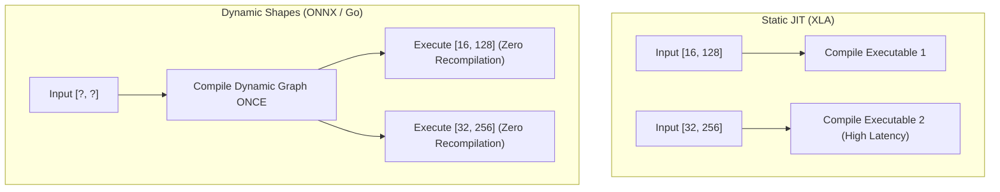

## Overview

Historically, ML compilers like XLA were designed around **static shapes**: every tensor dimension must be known at compile time, and passing an input with a different shape triggers JIT recompilation.

GoMLX supports **input-conditioned dynamic shapes**. This allows dimensions (such as batch size $N$, sequence length $L$, or spatial dimensions $H \times W$) to be symbolic (`shapes.DynamicDim` / `-1`). Graphs compiled with dynamic dimensions can process inputs of varying sizes at runtime without re-executing Go graph construction.



---

## Backend Capabilities

Backends declare their dynamic shape capabilities via `backend.Capabilities().DynamicShapes` (of type `compute.DynamicShapesSupport`):

| Mode | Enum Value | Description | Typical Backends |
| :--- | :--- | :--- | :--- |
| **Native** | `compute.DynamicShapesNative` | **True dynamic shapes**. Compiles once; executes arbitrary dynamic dimensions with zero recompilation latency. | `onnx` (ONNX Runtime), `go` (Portable Go) |
| **Recompiling** | `compute.DynamicShapesRecompiling` | **Backend-managed JIT specialization**. Accepts symbolic graphs and shares constant model weights, but specializes/recompiles kernels internally per shape. | `onnx:rocm` (ONNX Runtime for ROCm), TensorRT, TorchInductor |
| **None** | `compute.DynamicShapesNone` | **Static only**. Backend requires concrete static shapes. GoMLX rebuilds and compiles a new `*Executable` per shape. | `xla` (PJRT CPU/CUDA/TPU) |

You can query if dynamic shapes are supported programmatically:

```go
if backend.Capabilities().HasDynamicShapes() {
    // Dynamic shapes available
}
```

---

## Configuring `Exec` for Dynamic Shapes

When creating a `graph.Exec` or `model.Exec`, you specify which input axes are dynamic using `WithDynamicAxes` (or `WithDynamicAxesSpecs`):

```go
// Graph building function taking two inputs: tokens [batch, seq] and seqLen [batch]
graphFn := func(tokens, seqLen *Node) *Node {
    // ...
}

exec := graph.NewExec(backend, graphFn)

// Declare dynamic axes: "batch" and "seq" for tokens, "batch" for seqLen.
// Named axes with matching names are validated to have identical runtime dimension values.
exec.WithDynamicAxes(
    []string{"batch", "seq"}, // Input 0 (tokens)
    []string{"batch"},        // Input 1 (seqLen)
)
```

If an axis has an empty string `""`, it is an anonymous dynamic axis. If a slice entry is shorter than the input rank, trailing axes are assumed static.

---

## Operations Supporting Dynamic Shapes

GoMLX provides a rich set of operations designed to handle dynamic tensors seamlessly:

### 1. Dimension Abstraction & Size Extraction

- **`DimensionSpecFor(x, axis)`**: Returns a `DimensionSpec` for the given axis. If static, it returns `StaticDim(dim)`; if dynamic, it returns `NamedDynamicDim(name, DimensionSize(x, axis))`.
- **`DimensionSpecsFor(x)`**: Returns a slice of `DimensionSpec`s for all axes of `x`.
- **`DimensionSize(x, axis)`**: Returns an `Int32` scalar `*Node` representing the dimension size. Returns a constant `Scalar` on static shapes, or queries the backend on dynamic shapes.

### 2. Reshaping

- **`DynamicReshape(x, specs...)`**: Reshapes `x` to target `DimensionSpec`s (`StaticDim`, `DynamicDim`, `NamedDynamicDim`, `InferredDim`, `NamedInferredDim`). Automatically falls back to static `Reshape` if all dimensions are static.
- **`DynamicReshapeLike(x, ref)` / `ReshapeLike(x, ref)`**: Reshapes `x` to match the exact shape of `ref` (static or dynamic).
- **`Reshape(x, dims...)` / `ReshapeWithShape(x, shape)`**: Standard reshape operations automatically detect dynamic operands and delegate to dynamic reshape internally.

### 3. Broadcasting

- **`DynamicBroadcastInDim(x, broadcastAxes, specs...)`**: Low-level broadcast specifying which source axes map to which target `DimensionSpec`s.
- **`DynamicBroadcastLike(x, ref)` / `BroadcastLike(x, ref)`**: Broadcasts `x` to match the shape of reference node `ref` (works for both static and dynamic).
- **`DynamicBroadcastToShape(x, targetShape)` / `BroadcastToShape(x, targetShape)`**: Broadcasts `x` to a target static or dynamic `Shape`.
- **`DynamicBroadcastToDims(x, specs...)` / `BroadcastPrefix(x, targetRank)`**: Prefix-aligned broadcasting.

### 4. Sequence Generation & Padding

- **`DynamicIota(g, dtype, iotaAxis, specs...)`**: Generates sequence values `[0, 1, 2, ...]` along `iotaAxis` with dynamic dimensions.
- **`IotaLike(ref, iotaAxis)`**: Generates sequence values matching `ref`'s static or dynamic shape.
- **`DynamicPad(x, fillVal, padSpecs...)`**: Pads tensors with dynamic or static padding amounts.

### 5. Polymorphic Operations

Standard tensor operations work transparently with dynamic shapes without code changes:
- `ExpandAxes(x, axes...)`, `InsertAxes(x, axes...)`, `ExpandLeftToRank(x, rank)`
- `Squeeze(x, axes...)`
- `Slice(x, ranges...)`, `Gather(x, indices)`
- `Concatenate(nodes, axis)`, `Stack(axis, nodes...)`
- `Dot(a, b)`, `Einsum(equation, operands...)`
- `Where(cond, a, b)`
- `TopK(x, k)`, `TopKMask(x, k)`

---

## Writing Polymorphic Layers

Most layer libraries in GoMLX are written **polymorphically**: they work with both static and dynamic graphs without conditional branches:

```go
func LayerNorm(x *Node, epsilon float64) *Node {
    // DimensionSpecFor and DimensionSize work transparently on both static and dynamic inputs.
    mean := ReduceMean(x, -1)
    meanKeep := DynamicReshape(mean, append(DimensionSpecsFor(x)[:x.Rank()-1], StaticDim(1))...)
    
    variance := ReduceMean(Square(Sub(x, meanKeep)), -1)
    varianceKeep := DynamicReshape(variance, append(DimensionSpecsFor(x)[:x.Rank()-1], StaticDim(1))...)
    
    return Div(Sub(x, meanKeep), Sqrt(AddScalar(varianceKeep, epsilon)))
}
```

### Checking for Dynamic Shapes

If your algorithm requires specialized handling between static and dynamic graphs, you can inspect the shape at graph-building time:

```go
if x.Shape().IsDynamic() {
    // Dynamic shape execution path
} else {
    // Static shape specialized path
}
```

---

## When Dynamic Shapes Are Not Available: Bucketing & Padding

On static backends like **XLA** (`compute.DynamicShapesNone`), feeding tensors with arbitrary unconstrained shapes creates a new compiled binary for every unique shape:
- If sequence lengths vary from 1 to 512, there will be up to **512 separate JIT compilations**, causing massive latency spikes and memory bloat.

### Bucketing Strategy

To prevent compilation explosion on static backends, **bucket inputs into a small set of discrete sizes** and pad the remainder with zeros or padding tokens. Common bucketing strategies:

1. **Power-of-2 Bucketing**: Bucket sequence lengths into $32, 64, 128, 256, 512, \dots$.
2. **Two Bits Bucketing**: Bucket sequence lengths into numbers that use only the 2-bits: $16, 24, 32, 48, \dots$, see `github.com/gomlx/compute/support.TwoBitsBucketLen()`.
3. **Linear Bucketing**: Round up to multiples of 32 or 64.

### Sentence Tokenizer Bucketing

For text and NLP models using `go-huggingface`, use the [`tokenizers/bucket`](https://pkg.go.dev/github.com/gomlx/go-huggingface/tokenizers/bucket) package:

```go
import "github.com/gomlx/go-huggingface/tokenizers/bucket"

// Pack tokens into predefined bucket sizes with zero-padding
pack := bucket.Pack(tokenizedBatch, bucket.Config{
    BucketSizes: []int{32, 64, 128, 256, 512},
    PaddingID:   tokenizer.PadTokenID(),
})
```

This restricts the total number of compiled executables to the number of configured buckets, providing near-optimal GPU utilization without compilation explosion.
