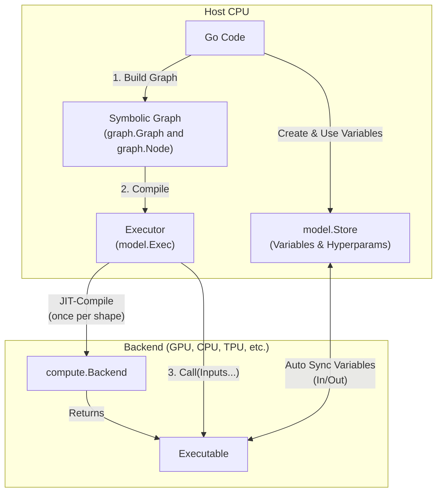

## Overview

GoMLX is built on a few abstractions. Understanding them makes every other part of the library click:

1. **Backend** — the connection to a hardware backend (CPU, GPU, TPU).
2. **Graph** — a computation graph that you define as a pure Go function.
3. **Tensor** — a concrete multi-dimensional array (or scalar) value, used as input and output when executing graphs. 
4. **Store** — a scoped storage for named and typed model parameters (weights), as well as hyperparameters of a model.

You can use just the backend and graph for mathematical computing, or add a `Store` to build trainable models.

### Conceptual Workflow

Below is a visualization of how these core components interact when building, JIT-compiling, and running computations in GoMLX:



---

## Backend

The `compute.Backend` connects your Go process to a hardware+software backend abstraction capable of executing our 
computations. Create one at program startup and reuse it everywhere :

<!-- sync_code: file=core-concepts/graph/main.go tag=cell1 -->
```go
import (
"github.com/gomlx/compute"
_ "github.com/gomlx/gomlx/backends/default" // Includes default backends.
)

backend, err := compute.New() // auto-selects best available backend
fmt.Printf("Backend: %s\n", backend.Description())
```
<div align="right"><small><a href="https://github.com/gomlx/gomlx/blob/main/examples/gomlx.github.io/core-concepts/graph/main.go#L13">(See source)</a></small></div>

Output:

<!-- sync_code: file=core-concepts/graph/main.go output_tag=cell1 -->
```
Backend: xla:cuda - PJRT "cuda" plugin (/home/janpf/.local/lib/go-xla/nvidia/pjrt_c_api_cuda_plugin.so) v0.112 [StableHLO] [1 device(s)]
```

The backend owns the device memory, compiles graphs to native code, and manages data transfer between "host" (your normal CPU) and device 
(can be the same CPU or a GPU, TPU, etc).
One backend per process is the typical pattern.


The `compute.New()` (or the `compute.MustNew()`) selects the best available backend in order: CUDA GPU → Metal (Apple) → CPU. 
To pin a specific backend, use the environment variable `GOMLX_BACKEND` or during construction
use the form  `compute.NewWithConfig("go")`.


The following backends are implemented so far:

- **"go"**: Pure Go implementation: simple, very portable but slower. It works in WASM also (so it can be
  used in websites).
- **"xla"** (or `"xla:cpu"`, `"xla:cuda"`, `"xla:tpu"`; use `"xla:help"` for an error with its options): uses [Google's XLA](https://openxla.org/), the same backend used by
 TensorFlow, Jax and optionally by PyTorch.
- [**go-darwinml**](https://github.com/gomlx/go-darwinml): (**experimental, in development**) it provides
  the `CoreML` (ANE, GPU, CPU) and the `MPSGraph` (GPU/Metal) backends.

---

## Computation Graphs

A **graph** is a pure function that describes a computation in terms of `*graph.Node` values and operations
connecting them.
GoMLX provides the high-level API to build these graphs. 
The computation graphs are then JIT-compiled and can be executed very efficiently by the selected backend.

<!-- sync_code: file=core-concepts/graph/main.go tag=cell2 -->
```go
import (
	. "github.com/gomlx/gomlx/core/graph"
)

addFn := func(a, b *Node) *Node {
	fmt.Printf("* building addFn computation graph: a.shape=%s, b.shape=%s\n", a.Shape(), b.Shape())
	return Add(a, b)
}
addExec, err := NewExec1(backend, addFn)
if err != nil {
	log.Fatalf("error creating computation graph: %+v\n", err)
}
v1, err := addExec.Call(1.0, 1.0)
if err != nil {
	log.Fatalf("Failed to compile/execute: %+v", err)
}
fmt.Printf("\t- 1+1=%s\n", v1)
fmt.Printf("\t- 2+2=%s\n", addExec.MustCall(2.0, 2.0))
```
<div align="right"><small><a href="https://github.com/gomlx/gomlx/blob/main/examples/gomlx.github.io/core-concepts/graph/main.go#L13">(See source)</a></small></div>

Output:

<!-- sync_code: file=core-concepts/graph/main.go output_tag=cell2 -->
```
* building addFn computation graph: a.shape=(Float64), b.shape=(Float64)
	- 1+1=float64(2)
	- 2+2=float64(4)
```


- The `addFn` was called only once to build the graph -- hence the message "* building addFn" was only printed once. 
  After the graph was built and compiled, it was simply executed twice with `addExec.Call()` and `addExec.MustCall()`. 
- We _dot imported_ the package `. "github.com/gomlx/gomlx/core/graph"`. This is common practice when most of the
  file contents are graph building blocks. 



### Why graphs?

This design gives the backend (XLA in this case) visibility over the entire computation so it can apply aggressive optimizations: operator fusion, memory layout selection, etc. — automatically.

Your Go code never runs on the GPU (or whatever is the accelerator device). Only the *compiled graph* runs there. This is the same design used by JAX `@jax.jit` and TensorFlow's `@tf.function`.

### Nodes are "future values", not concrete tensors

Inside a graph function, a `*graph.Node` represents a future value. You cannot inspect its contents during graph construction — only after calling `.Call()` (or equivalent, like `.MustCall1`).
Operations on nodes describe the graph structure.

The `*graph.Node` does carry information about the shape (dimensions and data type) of the value though, and they are used during graph building to check compatibility 
of the nodes for the operations -- e.g.: adding an `int` to a `float`, or values with different ranks are not valid operations, and return
an error.

<!-- sync_code: file=core-concepts/graph/main.go tag=cell3 -->
```go
_, err = addExec.Call(int32(1), float32(1.0))
if err != nil {
	//...
}
```
<div align="right"><small><a href="https://github.com/gomlx/gomlx/blob/main/examples/gomlx.github.io/core-concepts/graph/main.go#L50">(See source)</a></small></div>

Output:

<!-- sync_code: file=core-concepts/graph/main.go output_tag=cell3 -->
```
* building addFn computation graph: a.shape=(Int32), b.shape=(Float32)
Error: cannot broadcast Int32 and Float32 for "Add": they have different dtypes
	.../gomlx.github.io/core-concepts/graph/main.go:33
	.../gomlx.github.io/core-concepts/graph/main.go:50
```

### Exception-based Error Handling during Graph Building

Unlike standard Go code where errors are returned as values, GoMLX graph building functions panic (throw exceptions) when shape or type mismatches are found.

* **Why?** Writing long mathematical formulas would be cluttered and difficult to read if every operation returned an error.
* **How it works:** Panics only occur during the graph construction phase. 
  The `Exec` wrapper catches these panics automatically and returns them as standard Go errors (complete with stack traces) when `.Call()` is invoked.

See more in [Error Handling](/docs/advanced-usage/error-handling).

### Static Shapes & Recompilation Performance Trap

Behind the scenes, the backend compiles the computation graph to a highly optimized native binary for the target hardware. However, this JIT compilation is strictly tied to the **static shape** (the dimensions and data type) of the input nodes.

* **The Trap:** If you pass inputs of varying shapes (such as changing batch sizes or sequence lengths) to `Exec.Call`, GoMLX will JIT-compile a new graph for every new shape it sees. Since JIT compiling a graph is orders of magnitude slower than executing it, this will severely degrade performance.
* **Best Practice:** Reuse input shapes whenever possible. If your batch or sequence sizes vary, pad your inputs to fixed sizes (such as powers of two or predefined bucket lengths) to reuse already compiled graphs.

---

## Tensors

Tensors hold the inputs and outputs of a graph computation. They represent concrete multi-dimensional array values (including _scalar_ values), 
defined by their **shape** (`shapes.Shape`), which specifies the axes' dimensions and a data type (`dtypes.DType`).

### Shapes and data types (dtypes)

Every tensor has a shape (e.g. `(Float32)[2, 2]`), a list of dimension sizes, plus a `DType`. GoMLX checks shape compatibility at graph construction time, catching mismatches before any computation starts.

You can construct [tensors.Tensor](file:///home/janpf/Projects/gomlx/gomlx/core/tensors/tensor.go) objects from standard Go values (like multi-dimensional slices) using [FromValue](file:///home/janpf/Projects/gomlx/gomlx/core/tensors/local.go#L799):

<!-- sync_code: file=core-concepts/tensors/main.go tag=create -->
```go
// Tensors can be created from Go values, such as multi-dimensional slices
t := tensors.FromValue([][]float32{{1.0, 2.0}, {3.0, 4.0}})
fmt.Printf("Tensor shape: %s\n", t.Shape())
fmt.Printf("Tensor Go value: %v\n", t.Value())
```
<div align="right"><small><a href="https://github.com/gomlx/gomlx/blob/main/examples/gomlx.github.io/core-concepts/tensors/main.go#L20">(See source)</a></small></div>

Output:

<!-- sync_code: file=core-concepts/tensors/main.go output_tag=create -->
```
Tensor shape: (Float32)[2, 2]
Tensor Go value: [[1 2] [3 4]]
```

Common dtypes include `dtypes.Float32`, `dtypes.Float64`, `dtypes.Int32`, `dtypes.Int64`, and `dtypes.Bool`.

### Host vs. Device memory

Behind the scenes, a [Tensor](file:///home/janpf/Projects/gomlx/gomlx/core/tensors/tensor.go) maintains synchronization between its memory representation in host RAM (local CPU) and accelerator device memory (GPU/TPU):

<!-- sync_code: file=core-concepts/tensors/main.go tag=sync -->
```go
// Tensors cache data both locally (host CPU) and on accelerator devices.
// Transferring data between CPU and devices has a cost and is done lazily.
fmt.Printf("Has local copy? %v\n", t.HasLocal())
```
<div align="right"><small><a href="https://github.com/gomlx/gomlx/blob/main/examples/gomlx.github.io/core-concepts/tensors/main.go#L31">(See source)</a></small></div>

Output:

<!-- sync_code: file=core-concepts/tensors/main.go output_tag=sync -->
```
Has local copy? true
```

To avoid expensive memory copies, transferring data between host and device is performed lazily only when needed.

### Finalizing Tensors

Since the Go Garbage Collector cannot see memory allocated on accelerator devices (like CUDA GPUs), accelerator device memory is best if explicitly managed. 
When you are done with a tensor, you should explicitly call `FinalizeAll` (or `MustFinalizeAll`) to free its device buffers -- the GC will also free
the memory, but it may hold to it too long.

<!-- sync_code: file=core-concepts/tensors/main.go tag=finalize -->
```go
// Tensors allocate memory on accelerator devices (GPU, TPU).
// Because the Go Garbage Collector cannot track device memory,
// you must finalize tensors that are no longer in use to prevent memory leaks.
t.MustFinalizeAll()
```
<div align="right"><small><a href="https://github.com/gomlx/gomlx/blob/main/examples/gomlx.github.io/core-concepts/tensors/main.go#L41">(See source)</a></small></div>

### Images

The `github.com/gomlx/gomlx/core/tensors/images` package provides utilities to load standard Go images into tensors and export them back. When loading image batches, the resulting tensor shape is `[batch_size, height, width, channels]`:

<!-- sync_code: file=core-concepts/tensors/main.go tag=image -->
```go
// Create two simple blank images (e.g. 100x100 RGB).
img1 := image.NewRGBA(image.Rect(0, 0, 100, 100))
img2 := image.NewRGBA(image.Rect(0, 0, 100, 100))

// Load the batch of images into a Float32 tensor.
// The resulting shape is [batch_size, height, width, channels].
imagesTensor := timages.ToTensor(dtypes.Float32).Batch([]image.Image{img1, img2})
fmt.Printf("Batch images shape: %s\n", imagesTensor.Shape())
```
<div align="right"><small><a href="https://github.com/gomlx/gomlx/blob/main/examples/gomlx.github.io/core-concepts/tensors/main.go#L49">(See source)</a></small></div>

Output:

<!-- sync_code: file=core-concepts/tensors/main.go output_tag=image -->
```
Batch images shape: (Float32)[2, 100, 100, 3]
```


GoMLX uses the **NHWC** (`[batch_size, height, width, channels]`) layout for images by default. If you are porting models from frameworks like PyTorch that default to `NCHW` (`[batch_size, channels, height, width]`), you will need to transpose the axes (e.g. using `graph.Transpose` or configuring the layers accordingly).


---

## Gradients & Automatic Differentiation

A fundamental requirement for training neural networks is the ability to compute gradients. GoMLX performs automatic differentiation symbolically during the graph building phase. It automatically appends the mathematical operations required for back-propagation directly into the compiled graph.

Use the `graph.Gradient(loss, targets...)` function to calculate the gradient of a scalar node (typically the model's loss) with respect to a list of target nodes:

```go
func gradFn(x, y *Node) (loss, gradX, gradY *Node) {
    // f(x, y) = x^2 + xy
    loss = Add(Square(x), Mul(x, y))
    
    // Reduce if inputs are not scalars, as Gradient requires a scalar loss
    scalarLoss := ReduceAllSum(loss)
    
    // Calculate gradients df/dx and df/dy symbolically
    grads := Gradient(scalarLoss, x, y)
    return loss, grads[0], grads[1]
}
```


GoMLX currently supports computing the gradient of a scalar value (loss). It does not compute full Jacobians or Hessians directly, though higher-order gradients can be constructed manually by differentiating gradient nodes.


---

## The `model.Store` and Scopes

To build trainable models, you need a way to declare, retrieve, and update parameters (weights and biases) that persist across graph executions. The [Store](file:///home/janpf/Projects/gomlx/gomlx/ml/model/store.go#L33) is a hierarchical (tree-like) store for model parameters (represented by [Variable](file:///home/janpf/Projects/gomlx/gomlx/ml/model/variable.go)) and hyperparameters.

It is important to understand the division of responsibilities here:
* **`model.Store`**: This is the actual stateful container that physically stores the variable values (tensors representing weights and biases) and hyperparameters of your model in memory. It persists across multiple JIT compilations and graph executions.
* **`model.Scope`**: This is a lightweight pointer that represents a specific path or "current directory" within the hierarchical `Store` (e.g., `/layer1`). Layer functions accept a `*model.Scope` and construct or look up variables relative to their current scope, which prevents name collisions and organizes weights cleanly (e.g., `/layer1/weights`, `/layer2/weights`).

### Model Variables and Executors

Instead of using the basic `graph.Exec`, neural network architectures use [Exec](file:///home/janpf/Projects/gomlx/gomlx/ml/model/exec.go). It is constructed with a [Store](file:///home/janpf/Projects/gomlx/gomlx/ml/model/store.go#L33) and automatically handles passing variables as extra inputs and outputs to the compiled graph.

Here is a simple counter that increments a variable in the store on each step:

<!-- sync_code: file=core-concepts/store/main.go tag=counter -->
```go
store := model.NewStore()
counterFn := func(scope *model.Scope, g *Graph) *Node {
	counterVar := scope.VariableWithValue("counter", int32(0))
	counter := AddScalar(counterVar.NodeValue(g), 1)
	counterVar.SetNodeValue(counter)
	return counter
}

exec := model.MustNewExec(backend, store, counterFn)
fmt.Printf("Step 1: %v\n", exec.MustCall1())
fmt.Printf("Step 2: %v\n", exec.MustCall1())
fmt.Printf("Step 3: %v\n", exec.MustCall1())
```
<div align="right"><small><a href="https://github.com/gomlx/gomlx/blob/main/examples/gomlx.github.io/core-concepts/store/main.go#L39">(See source)</a></small></div>

Output:

<!-- sync_code: file=core-concepts/store/main.go output_tag=counter -->
```
Step 1: int32(1)
Step 2: int32(2)
Step 3: int32(3)
```

Inside the model function, `scope.VariableWithValue` retrieves or initializes the variable, `counterVar.NodeValue(g)` returns the node representing its current value, and `counterVar.SetNodeValue(counter)` updates its value in the store with the computation result.

### Scopes and Hierarchical Parameters

A [Scope](file:///home/janpf/Projects/gomlx/gomlx/ml/model/scope.go) represents a path in the hierarchical store (similar to directories). When building complex model architectures, scopes allow you to separate variables of different layers.

Here is an example of defining a custom `denseLayer` function and applying it to different sub-scopes using `scope.In`:

<!-- sync_code: file=core-concepts/store/main.go tag=scopes -->
```go
func denseLayer(scope *model.Scope, x *Node, outputDims int) *Node {
	g := x.Graph()
	dtype := x.DType()
	inputDims := x.Shape().Dimensions[1] // x shape is [batch, inputDims]

	// Create weights and biases in the current scope
	weights := scope.VariableWithShape("weights", shapes.Make(dtype, inputDims, outputDims)).NodeValue(g)
	biases := scope.VariableWithShape("biases", shapes.Make(dtype, 1, outputDims)).NodeValue(g)

	// Compute x * weights + biases
	return Add(Dot(x, weights).Product(), biases)
}
modelFn := func(scope *model.Scope, x *Node) *Node {
	// Use scope.In to partition variable names under sub-scopes:
	h := denseLayer(scope.In("layer1"), x, 3) // variables: /layer1/weights, /layer1/biases
	y := denseLayer(scope.In("layer2"), h, 1) // variables: /layer2/weights, /layer2/biases
	return y
}
```
<div align="right"><small><a href="https://github.com/gomlx/gomlx/blob/main/examples/gomlx.github.io/core-concepts/store/main.go#L17">(See source)</a></small></div>

Using `scope.In("layer1")` ensures that the weights and biases of the first layer are stored under paths like `/layer1/weights` and `/layer1/biases`, avoiding conflicts with other layers.

If we run the model function, we can inspect all of the variables registered in the store:

<!-- sync_code: file=core-concepts/store/main.go tag=print_vars -->
```go
// We can inspect all variables in the store:
for v := range store.IterVariables() {
	fmt.Printf("Variable: %s, shape: %s\n", v.Path(), v.Shape())
}
```
<div align="right"><small><a href="https://github.com/gomlx/gomlx/blob/main/examples/gomlx.github.io/core-concepts/store/main.go#L76">(See source)</a></small></div>

Output:

<!-- sync_code: file=core-concepts/store/main.go output_tag=print_vars -->
```
Variable: /counter, shape: (Int32)
Variable: /layer1/weights, shape: (Float32)[2, 3]
Variable: /layer1/biases, shape: (Float32)[1, 3]
Variable: /layer2/weights, shape: (Float32)[3, 1]
Variable: /layer2/biases, shape: (Float32)[1, 1]
Variable: /#rngState, shape: (Uint64)[3]
```

---

## Training a Model

Training a model in GoMLX brings together all the building blocks: the backend, the [Store](file:///home/janpf/Projects/gomlx/gomlx/ml/model/store.go#L33) for tracking weights, [Dataset](file:///home/janpf/Projects/gomlx/gomlx/ml/dataset/inmemory.go) iteration, and the [Trainer](file:///home/janpf/Projects/gomlx/gomlx/ml/train/trainer.go#L169) / [Loop](file:///home/janpf/Projects/gomlx/gomlx/ml/train/loop.go).

Here is a complete, working example that trains a small Multi-Layer Perceptron (MLP) to overfit (memorize) an image. The network learns a function $f(x, y) \to (r, g, b)$ that maps normalized pixel coordinates to the corresponding color at that location:

<!-- sync_code: file=core-concepts/training/main.go tag=training -->
```go
// 1. Prepare training data: mapping (x, y) coordinates to (r, g, b) colors
inputs := make([][]float32, 0, width*height)
labels := make([][]float32, 0, width*height)

for y := range height {
	for x := range width {
		// Normalize coordinates to [-1.0, 1.0] for stable neural network training
		nx := float32(x)/float32(width)*2.0 - 1.0
		ny := float32(y)/float32(height)*2.0 - 1.0
		inputs = append(inputs, []float32{nx, ny})

		r, g, b, _ := img.At(bounds.Min.X+x, bounds.Min.Y+y).RGBA()
		labels = append(labels, []float32{float32(r) / 65535.0, float32(g) / 65535.0, float32(b) / 65535.0})
	}
}

backend := compute.MustNew()
store := model.NewStore()

// 2. Create an InMemoryDataset from the prepared coordinates and pixel colors
ds, err := dataset.InMemoryFromData(backend, "image_pixels", []any{inputs}, []any{labels})
if err != nil {
	log.Fatalf("failed to create dataset: %v", err)
}
// Configure dataset to yield random batches of size 128 continuously (infinitely)
ds.BatchSize(512, false).Shuffle().Infinite(true)

// 3. Define the neural network model function (MLP)
modelFn := func(scope *model.Scope, spec any, inputs []*Node) []*Node {
	x := inputs[0] // shape: [batch_size, 2]

	h := denseLayer(scope.In("layer1"), x, 64)
	h = activation.Relu(h)
	h = denseLayer(scope.In("layer2"), h, 64)
	h = activation.Relu(h)
	h = denseLayer(scope.In("layer3"), h, 64)
	h = activation.Relu(h)

	// Output RGB values mapped to [0.0, 1.0] using Sigmoid
	y := Sigmoid(denseLayer(scope.In("output"), h, 3))
	return []*Node{y}
}

// 4. Initialize Trainer with Adam optimizer and Mean Squared Error (MSE) loss
trainer := train.NewTrainer(
	backend,
	store,
	modelFn,
	loss.MeanSquaredError,
	optimizer.Adam().LearningRate(0.003).Done(),
	nil, // Train step metrics (optional)
	nil, // Eval metrics (optional)
)

// 5. Run the training loop for -steps (default 5000) steps
loop := train.NewLoop(trainer)
// Register a simple callback to print loss metrics periodically
train.EveryNSteps(loop, 1000, "log_metrics", 0, func(l *train.Loop, metrics []*tensors.Tensor) error {
	fmt.Printf("Step %5d: MSE Loss = %.6f (moving average = %.6f)\n", l.LoopStep, metrics[0].Value(), metrics[1].Value())
	return nil
})

fmt.Println("Starting training loop...")
_, err = loop.RunSteps(ds, *trainSteps)
if err != nil {
	log.Fatalf("training failed: %v", err)
}
fmt.Println("Training finished!")
```
<div align="right"><small><a href="https://github.com/gomlx/gomlx/blob/main/examples/gomlx.github.io/core-concepts/training/main.go#L87">(See source)</a></small></div>

Output:

<!-- sync_code: file=core-concepts/training/main.go output_tag=training -->
```
Starting training loop...
Step   999: MSE Loss = 0.000026 (moving average = 0.000032)
Step  1999: MSE Loss = 0.000038 (moving average = 0.000023)
Step  2999: MSE Loss = 0.000013 (moving average = 0.000028)
Step  3999: MSE Loss = 0.000017 (moving average = 0.000023)
Step  4999: MSE Loss = 0.000025 (moving average = 0.000015)
Training finished!
Successfully reconstructed image saved to reconstructed.png
```

Each of these pieces — the backend, model, store, loss, optimizer, and training loop — is independently replaceable:
- Swap out the Adam optimizer for `optimizers.StochasticGradientDescent()` or any other strategy.
- Modify the neural network definition or layers without changing how the training loop or dataset works.
- Load weights (store) from a different checkpoint, or create the average of the last 10 checkpoints.
- Switch the backend from CUDA GPU to Metal/CPU without altering any machine learning code.

That's what makes GoMLX powerful for research and experimentation.

See more details in: **Datasets**, **Hyperparameters**, **Losses**, **Optimizers**, **Metrics**, **Checkpointing (Saving)** <!-- link to future topics with their own pages -->
