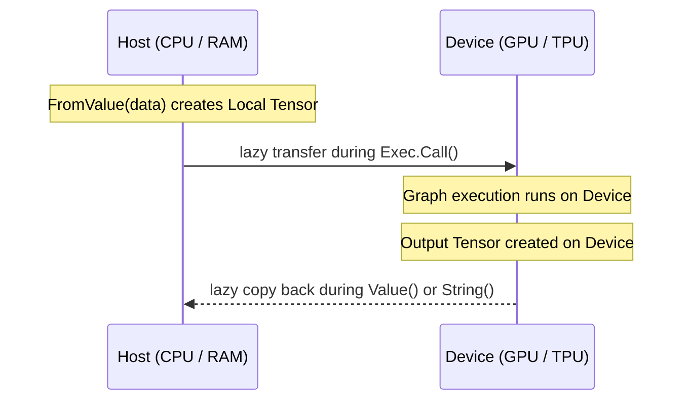

## Overview

A **Tensor** (`*tensors.Tensor`) is a multi-dimensional array of a specific data type. These are the concrete inputs and outputs of your GoMLX models.
They can hold floats of various types, images, coordinates, class ids, tokens (ints), etc.

---

## Shape and Data Types (DTypes)

Every tensor has a fixed `shapes.Shape`, defined by:
1. **Dimensions**: An integer slice specifying the size along each axis. For example, `[128, 28, 28, 3]` might represent a batch of 128 images of size 28x28 with 3 color channels. A scalar (0D) value has an empty dimension slice `[]`.
2. **DType**: The underlying numeric representation (`dtypes.DType`). Supported types include:
   * **Floating-point**: `dtypes.Float32`, `dtypes.Float64`
   * **Integers**: `dtypes.Int32`, `dtypes.Int64`, `dtypes.Int8`, `dtypes.Int16`
   * **Unsigned Integers**: `dtypes.Uint8`, `dtypes.Uint16`, `dtypes.Uint32`, `dtypes.Uint64`
   * **Boolean**: `dtypes.Bool`
   * **Half-precision**: `dtypes.Float16`, `dtypes.BFloat16`

---

## Host vs. Device Memory

A tensor can store its raw data in local CPU RAM (host memory) or on the accelerator device: GPU, TPU and also CPU, but managed by the backend. 
GoMLX automatically manages data synchronization between host and device **lazily**:



* **Inputs**: When you create a tensor from Go slices using `tensors.FromValue()`, the data initially resides in CPU RAM. When you feed it into `Exec.Call()`, GoMLX copies the data to the device memory.
* **Outputs**: Execution outputs are initially kept in device memory. GoMLX only fetches the data back to CPU RAM when you explicitly request it (e.g., calling `tensor.Value()` to convert it to a Go slice, or printing it).
* **Latency Warning**: Copying data between CPU memory and GPU/TPU memory across the PCIe bus is slow. Keep data on-device as much as possible by passing tensors directly from one execution's output to the next execution's input.

---

## Creating Tensors

### 1. From Go Values
You can instantiate tensors from scalars, slices, and nested slices of any rank:
```go
// Create a 1D vector tensor of Int64
t1 := tensors.FromValue([]int64{10, 20, 30})

// Create a 2D matrix tensor of Float32
t2 := tensors.FromValue([][]float32{{1.0, 2.0}, {3.0, 4.0}})
```
*Note: Nested slices must be regular (every sub-slice must have the exact same length).*

### 2. Zero-Initialized Allocations
To allocate memory for a tensor without filling it immediately:
```go
shape := shapes.Make(dtypes.Float32, 100, 100)
t := tensors.FromShape(shape) // Instantiates an all-zero [100, 100] Float32 tensor
```

### 3. From Scalar and Dimensions (Generics)
If you want to construct tensors filled with a single value, GoMLX provides type-safe generic functions:
```go
// Create a 0-dimensional scalar tensor containing 3.14
scalarT := tensors.FromScalar(float32(3.14))

// Create a 3x5 matrix filled with 1.0
filledT := tensors.FromScalarAndDimensions(float64(1.0), 3, 5)
```

### 4. Shared Buffers (CPU Backends)
When using CPU backends, copying data between Go's runtime memory and the execution backend is unnecessary. You can utilize **shared buffers** to achieve zero-copy data transfer:

```go
// Create a zero-initialized tensor sharing its backing memory directly with the backend
t, err := tensors.FromShapeForBackend(backend, 0, shape)
```
* If the backend supports shared buffers (like the pure Go backend `"go"` or XLA's CPU backend), the memory is allocated once and shared directly. No extra copying is done during graph execution.
* If shared buffers are not supported (e.g., GPU/TPU device targets), this automatically falls back to allocating local CPU memory (equivalent to `FromShape(shape)`).

### 5. Importing Numpy Arrays
You can read files saved in Python via Numpy (`.npy` format) into GoMLX using the `github.com/gomlx/gomlx/core/tensors/numpy` package.

---

## Direct Value Access (Flat Data)

For high-performance applications or simply for memory concious ones, converting a tensor from/to nested Go slices (e.g., `[][]float32` via `tensor.Value()`) is too slow or allocates too much garbage.
GoMLX allows directly accessing the underlying flat data array directly.

These operations lock the tensor while the callback executes:

### 1. Read-Only Access (`ConstFlatData`)
Use `ConstFlatData` (or the panicking version `MustConstFlatData`) to read values:
* **Host download**: If the tensor's data resides only in device memory, GoMLX will trigger a synchronous transfer to pull it to CPU memory before running the callback.
* **Callback parameters**: The callback receives a flat Go slice representing the raw data (e.g., `[]float32`).

Using the struct method (returns `any`):
```go
err := tensor.ConstFlatData(func(flat any) {
    data := flat.([]float32)
    fmt.Println("First element:", data[0])
})
```

Using the package-level type-safe generic helper:
```go
tensors.MustConstFlatData(tensor, func(flat []float32) {
    fmt.Println("First element:", flat[0])
})
```

### 2. Read-Write Access (`MutableFlatData`)
Use `MutableFlatData` (or `MustMutableFlatData`) to modify values in place:
* **Device Invalidation**: When you modify a tensor's flat data, GoMLX marks the device memory copy as stale/invalid. The updated data will be re-uploaded to the accelerator device on the next graph execution call.

Using the struct method:
```go
tensor.MustMutableFlatData(func(flat any) {
    data := flat.([]float32)
    data[0] = 99.0 // Modifies the value in place
})
```

Using the package-level generic helper:
```go
err := tensors.MutableFlatData(tensor, func(flat []float32) {
    flat[0] = 99.0
})
```

### 3. Packed Sub-byte Values (`ConstBytes` & `MutableBytes`)
For sub-byte packed data types (like `Int4`, `Uint4`, `Int2`, etc.), accessing the flat data via standard slices yields interpretation challenges. GoMLX provides `ConstBytes` and `MutableBytes` to expose the raw backing byte slice (`[]uint8`) directly:

```go
err := tensor.ConstBytes(func(data []byte) {
    // Process raw packed bits
})
```

---

## Managing Device Memory (Finalization)

Since the Go Garbage Collector (GC) runs on the host CPU and only tracks standard CPU RAM, it has no visibility into the memory usage of accelerators (like GPU or TPU device memory), nor the custom allocations managed directly by PJRT/XLA on the CPU. 
Because of this, you can run out of device memory long before Go's garbage collector decides to run a collection cycle.

To prevent memory exhaustion and leaks, you should **manually finalize** tensors as soon as they are no longer needed:

```go
// Releases the backing device/host buffer immediately
tensor.MustFinalizeAll()
```

### Dataset and Training Loop Ownership Rules
When working with GoMLX's high-level training packages (`ml/train`):

* **Dataset Yields**: When you call `train.Dataset.Iter()`, it yields `train.Batch` packages. The ownership of the input and label tensors in a `Batch` is transferred to the caller of `Iter()`.
* **Step Consumption**: If you invoke `trainer.TrainStep(batch)` (or `trainer.EvalStep(batch)`) manually, the trainer **takes ownership** of the batch's tensors and will automatically finalize them once the step completes.
* **Automatic Loops**: If you use the standard training loop (`train.Loop.RunSteps(dataset, steps)` or `RunEpochs`), the loop manager handles dataset pulling, training step execution, and tensor finalization for you automatically. You do **not** need to manually finalize the training batches.
* **Manual Iteration Warning**: If you read from a `train.Dataset` manually outside a trainer execution, you **must** call `batch.Finalize()` at the end of each loop iteration to avoid memory leaks (unless the tensors inside the batch were already donated to an execution):
  ```go
  for batch := range dataset.Iter() {
      // process batch...
      
      // If we do not donate the tensors to an execution, we must finalize them:
      batch.Finalize() 
  }
  ```

### Tensor Donation (`graph.DonateTensorBuffer`)
When executing computation graphs, you can instruct the backend compiler to **donate** an input tensor's backing device buffer to the graph execution via `graph.DonateTensorBuffer`. 

* **How it works**: Instead of allocating new device memory for execution outputs, the compiler can reuse the memory space of the donated input tensor directly. This is highly recommended for updating states in loops (such as model weights or training step indices) because it keeps memory footprint constant.
* **`model.Store` Integration**: The high-level model variable manager (`model.Store`) uses tensor donation automatically under the hood. When executing graphs that update variables (e.g., using `model.Exec`), the store automatically donates the current variable tensors to the execution step, replacing them with the updated output tensors.
* **Sparse / Partial Updates**: This mechanism is heavily optimized in XLA and backend compilers. If a large variable is only partially updated (for instance, modifying only a few rows of a large embedding table), the compiler can use the donated buffer to modify the data in place, avoiding the need to fully copy or re-allocate the massive embedding matrix.
* **Tensor Invalidation & Shared Buffers**: Once donated, the input tensor's device buffer is taken over by the backend execution engine, and you do **not** need to call `.Finalize()` on it. The behavior regarding the local tensor validity depends on whether it uses a shared buffer:
  * **Non-shared Tensors** (e.g., on GPUs): Only the device buffer is donated. The local host CPU copy remains alive and valid, meaning `tensor.Ok()` is still true (though the tensor is no longer on the device).
  * **Shared Tensors** (e.g., on CPU backends with shared buffers): The shared buffer itself is donated. Since there is no separate host CPU copy, the entire tensor is invalidated, and `tensor.Ok()` becomes false.

#### Example:
```go
// 1. Mark the input tensor to donate its device buffer
donatedInput, err := graph.DonateTensorBuffer(inputTensor, backend, 0)
if err != nil {
    log.Fatal(err)
}

// 2. Call the execution with the donated input.
// The device will reuse inputTensor's buffer space for the outputs where possible.
outputs, err := exec.Call(donatedInput)

// 3. Since inputTensor was donated, we do not need to call inputTensor.FinalizeAll().
// We only need to finalize the returned outputs when they are done.
outputs[0].MustFinalizeAll()
```

---

## Working with Images

The `github.com/gomlx/gomlx/core/tensors/images` package makes it easy to load standard Go `image.Image` objects into float tensors:

```go
// Load an image batch. Resulting shape will be [batch_size, height, width, channels]
imagesTensor := timages.ToTensor(dtypes.Float32).Batch([]image.Image{img1, img2})
```


**Image Layout (NHWC)**: GoMLX expects images in **NHWC** format:
* `N`: Batch size
* `H`: Height
* `W`: Width
* `C`: Color Channels (typically 3 for RGB, 1 for Grayscale)

If you are loading files or porting code from frameworks that expect `NCHW` (like PyTorch), you must transpose the axes (e.g. using `graph.Transpose` or setting the layers parameters) before processing.


---

## Serialization (Gob)

GoMLX tensors can be easily serialized and deserialized using Go's standard `encoding/gob` package:

* **`tensor.GobSerialize(encoder *gob.Encoder) error`**: Serializes the tensor (both its shape and flattened data representation) into a gob stream.
* **`tensors.GobDeserialize(decoder *gob.Decoder) (*Tensor, error)`**: Deserializes a tensor from a gob stream back into host CPU memory.
* **`tensors.GobDeserializeToDevice(decoder *gob.Decoder, backend compute.Backend, deviceNum compute.DeviceNum) (*Tensor, error)`**: Directly deserializes a tensor from a gob stream straight to the target accelerator device (GPU/TPU) memory, avoiding an extra host-to-device copy step.
