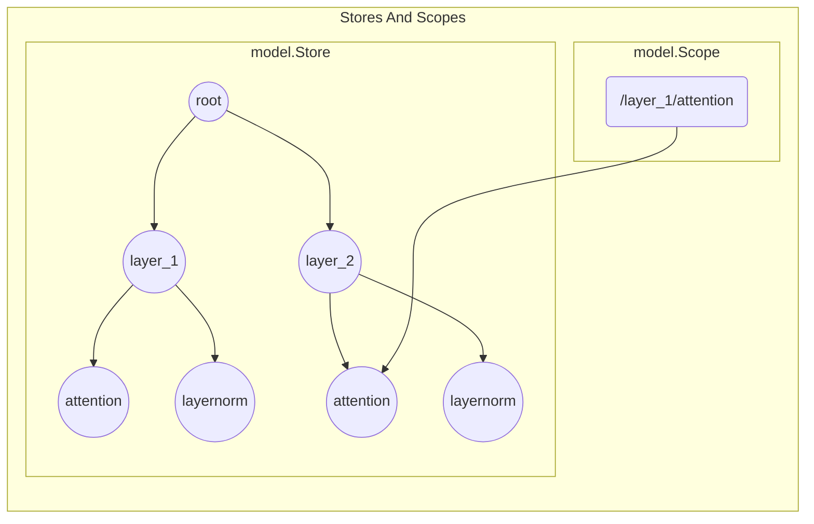

## Overview

Computation graphs in GoMLX are functional and stateless. To build trainable neural networks, we need a mechanism to declare, retrieve, and update parameters (such as weights and biases) and hyperparameters that persist across graph executions. 

GoMLX implements this state management through the `github.com/gomlx/gomlx/ml/model` package, utilizing **`model.Store`** and **`model.Scope`** to organize and manage variables and hyperparameters in a hierarchical arrangement.

---

## Store vs. Scope

It is helpful to think of `Store` and `Scope` as a filesystem containing variables and parameters:



1. **`model.Store`**: This is the actual container registry that holds all the stateful variables (`model.Variable` tensors containing weights/biases) and hyperparameters of your model in memory. The `Store` persists across multiple compile/run cycles and is the object saved to disk during checkpointing.
2. **`model.Scope`**: This is a lightweight pointer representing a specific location (or path) inside the `Store`. Scopes are passed down through layer functions (like `layers.Dense` or `layers.Convolution`) to keep variable names organized hierarchically, preventing collisions.

---

## Working with Scopes

Every store starts with a root scope (`store.RootScope()`), which points to `/`. You navigate down into sub-scopes using path-building methods. GoMLX offers three distinct ways to enter a sub-scope:

### 1. Unique Sub-scopes (`scope.In`)
This is the most common method. It enters a unique sub-scope.
```go
// Creates a scope pointing to "/dense_layer"
denseScope := scope.In("dense_layer")
```
* **Guard against mistakes**: To prevent accidental namespace sharing, `scope.In` will panic if you attempt to visit the exact same sub-scope path twice.

### 2. Shared Sub-scopes (`scope.Shared`)
Used when you explicitly want to reuse parameters across different parts of a model (e.g., Siamese neural networks or recurrent architectures).
```go
// Enters a scope to reuse weights. Will panic if the scope has not been visited yet.
sharedScope := scope.Shared("shared_dense")
```

### 3. Absolute Sub-scopes (`scope.At`)
Enters a sub-scope regardless of whether it has been visited before. Use this when you do not need the safety checks of `In` or `Shared`.

---

## Declaring and Accessing Variables

Variables represent the weights and biases of a model. They are created relative to the current `model.Scope`:

```go
// Create a weights variable initialized with zeros
weightsVar := scope.VariableWithShape("weights", shapes.Make(dtypes.Float32, inFeatures, outFeatures))

// Create a counter variable initialized with a starting value
counterVar := scope.VariableWithValue("counter", int32(0))
```

### Accessing Variables
* **During Graph Building**: Use `variable.NodeValue(graph)` to retrieve a `*graph.Node` representing the variable's current value in the graph. To update the variable's value, call `variable.SetNodeValue(updatedNode)`.
* **Outside Graph Building**: Use `variable.Value()` and `variable.SetValue(tensor)` to read or overwrite the underlying concrete `*tensors.Tensor` directly on the host CPU.

---

## Hyperparameters

In addition to stateful variables, a `model.Scope` also carries hyperparameters (configuration parameters). They are organized hierarchically, allowing children scopes to inherit parameters from parent scopes unless overridden.

See the dedicated [Hyperparameters](/docs/hyperparameters/) page for details on how this hierarchical parameter management can be used to simplify managing hyperparameters across complex networks and training sweeps.

### Setting Hyperparameters
```go
// Set parameter on the root scope (inherited by all sub-scopes)
store.SetParam("learning_rate", 0.001)
store.SetParam("l2_regularization", 1e-4)

// Override parameter for a specific layer scope
store.RootScope().In("output_layer").SetParam("l2_regularization", 0.0)
```

### Retrieving Hyperparameters
Inside a layer function, you retrieve a hyperparameter using `model.GetParamOr`:
```go
// Resolves "l2_regularization" by searching "output_layer", and falls back to "/" or default
l2 := model.GetParamOr(scope, "l2_regularization", 1e-5)
```

---

## Model Executors (`model.Exec`)

To execute graphs that use model variables and scopes, you use a `model.Exec` object instead of a basic `graph.Exec`.

```go
// Create a model executor tied to a store
exec := model.MustNewExec(backend, store, func(scope *model.Scope, x *Node) *Node {
    // Graph building code using scope variables
    h := layers.Dense(scope.In("layer1"), x, 64)
    return layers.Dense(scope.In("layer2"), h, 1)
})
```

`model.Exec` automatically inspects the graph to see which variables are read or updated, then:
1. Passes the current variable tensors as **side-inputs** to the compilation.
2. Extracts updated variable tensors as **side-outputs** from the execution.
3. Automatically updates the variable values inside the `model.Store` with the execution outputs.

---

## Checkpointing (Saving and Loading)

Model checkpoints allow you to persist training progress, recover from failures, or load pre-trained weights for inference. GoMLX manages checkpoints using the `checkpoint.Handler` struct. You configure and instantiate it using a builder pattern starting with `checkpoint.Build(store)`. Beyond model weights and variables, the checkpoint directory is also automatically used to save training metrics (such as losses, learning rates, and evaluation scores) as the training loop progresses, keeping a historical record of your run.

### 1. Configure the Storage Location
Before finalizing the builder, you must specify exactly one source/destination target:
* **`Dir(path)`**: Saves and loads checkpoint files in the specified directory. It will read existing checkpoints if present, or create the directory if it does not exist.
* **`TempDir(dir, pattern)`**: Automatically creates a temporary directory for checkpoints (using a suffix-based naming pattern), which is useful for temporary training sessions or tests.
* **`FromEmbed(json, binary)`**: Loads checkpoints compiled directly into your Go binary using `//go:embed`. This is ideal for distributing pre-trained inference models without external file dependencies.

### 2. Configure Checkpoint Behavior
* **`Keep(n)`**: Limits the number of recent checkpoints to preserve on disk. Older checkpoints are pruned automatically as new ones are saved. Set to `-1` to keep all checkpoints.
* **`TakeMean(n, backend)`**: Loads the average (mean) values of the last `n` checkpoints across all trainable variables. Averaging checkpoints is a common technique to stabilize evaluation metrics and improve model generalization.
* **`WithCompression(format)`**: Compresses the checkpoint binary file (defaulting to GZIP compression) to save disk space, which is especially important for large neural networks.

### 3. Configure Hyperparameters
* **`ExcludeParams(params...)`**: Excludes specific hyperparameters from being overwritten by the checkpoint. This allows you to override checkpointed hyperparameters (like the learning rate) using command-line flags or code configuration at startup.

### 4. Build the Handler
Call `.Done()` at the end of the chain to instantiate the `checkpoint.Handler` and trigger the initial load of variables and hyperparameters into the `model.Store`.

---

### Example: Periodic Saving during Training

Here is how you initialize a checkpoint handler and register it to automatically save your model every 10 minutes:

```go
import (
    "time"
    "github.com/gomlx/gomlx/ml/model/checkpoint"
    "github.com/gomlx/gomlx/ml/train"
)

// 1. Build the checkpoint handler
checkpointHandler, err := checkpoint.Build(store).
    Dir("/path/to/checkpoints").
    Keep(5). // Retain only the 5 most recent checkpoints
    Done()
if err != nil {
    log.Fatalf("Failed to initialize checkpoint: %v", err)
}

// 2. Schedule automatic checkpoint saves every 10 minutes
savePeriod := 10 * time.Minute
train.PeriodicCallback(
    loop, 
    savePeriod, 
    true,                   // Execute immediately on startup
    "saving checkpoint", 
    100,                    // Callback priority
    checkpointHandler.SaveOnStepFn,
)
```

### Lazy Loading Optimization
The `checkpoint.Handler` loads variables **lazily** by default. When you restore a model, variables are not read into system memory until they are explicitly accessed during graph construction. 

This optimization saves significant memory and startup time. For example, during inference, training-only variables (like optimizer momentum vectors) are never accessed by the graph, meaning their binary data is never loaded from the disk.

If you need to force variables to load immediately (for instance, when inspecting model weights), you can call `Immediate()` on the config builder before calling `.Done()`.

### Inspecting and Modifying Checkpoints (`gomlx_checkpoints`)

GoMLX includes a powerful command-line utility called `gomlx_checkpoints`, located in the [gomlx/cmd/gomlx_checkpoints/](file:///home/janpf/Projects/gomlx/gomlx/cmd/gomlx_checkpoints/) directory. You can install it locally to inspect, monitor, or modify checkpoint folders:

```bash
# Build and install the tool
go install github.com/gomlx/gomlx/cmd/gomlx_checkpoints@latest

# Inspect a checkpoint folder
gomlx_checkpoints /path/to/checkpoints
```

Key subcommands and flag options include:
* **`--summary`**: Displays a high-level summary of the model size (total parameters and memory footprint) under the active `--scope`.
* **`--vars`**: Enumerates all variables in the model checkpoint under the given `--scope` (default `/`), listing their shape, byte size, and statistical values (mean absolute value, root-mean-square, and max absolute value) to assist in debugging numerical stability.
* **`--params`**: Lists all active hyperparameters saved in the checkpoint.
* **`--metrics`**: Reads and lists all collected training metrics from the checkpoint directory.
* **`--plot`**: Generates an interactive HTML file with plots of training metrics and opens it in your default web browser (configured via `--plot_output` and `--browser`).
* **`--loop <duration>`**: Sets up a polling loop (e.g., `--loop 5s`) to continuously clear the screen and refresh the metrics report, which is useful for monitoring training in real time.
* **`--delete_vars <comma_separated_scopes>`**: Deletes variables matching specific scopes from the checkpoint files. This is extremely useful to **trim models of training/optimizer state** (such as Adam running averages) before distributing them for inference, significantly reducing the final file size.
* **`--perturb <fraction>`**: Perturbs trainable float variables by a random uniform noise fraction, helping you test model robustness.
* **`--backup`**: Creates a backup copy of the most recent checkpoint in a `backup/` subdirectory before performing deletions or modifications.

---

There are more configuration options and functionality available; check the `checkpoint` package for details.